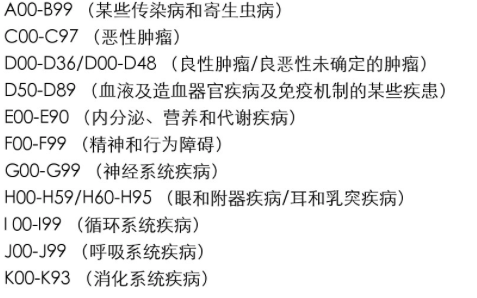
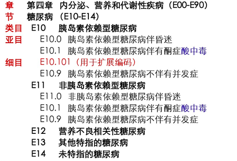
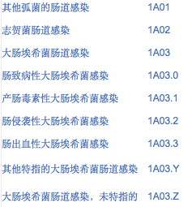

# ICD10

***

### 一、简介 

国际疾病分类（international Classification of diseases）是WHO制定的国际统一的疾病分类方法，它根据疾病的**病因、病理、临床表现和解剖位置**等特性，将疾病分门别类，使其成为一个有序的组合，并用编码的方法来表示的系统。全世界通用的是第10次修订本《疾病和有关健康问题的国际统计分类》，仍保留了ICD的简称，并被统称为ICD-10。

***

系统收录了疾病记录近**26000**多条，内容全面准确，涵盖医院所有科别的各种疾病，是国内目前最完备的，最新的ICD-10专用编码查询数据库系统，主要包括**ICD-10编码，手术码，疾病名称，拼音码**。支持**疾病、类别的双向查询，拼音与汉字模糊查询**等，2.0版新增，新增**中英文对照查询**，查询功能更方便。本身为小型数据库，可以自己开发出更多功能。同时系统支持将数据库导出为EXCEL电子表格，ACCESS可以直接调用，可以挂接或者转换成其它各种数据库。功能上比注册后的光盘版本少一些。如：疾病分类数量（非注册版本仅有几千余条，注册版本有2万多条）、打印功能、二次开发更改设计功能和部分新增功能。

***

***

#### 1 发展历史

ICD已有110年的发展历史，早在 1891年为了对死亡进行统一登记，国际统计研究所组织了一个对死亡原因分类的委员会进行工作，1893年 该委员会主席Jacques Bertillon提出了一个分类方法《国际死亡原因编目》，此即为第一版。以后基本上为10年修订一次。1940年第6次修订版由世界卫生组织承担该工作，首次引入了疾病分类，并强调继续保持用病因分类的哲学思想。1994年在日内瓦第10次修改版本在世界得到了广泛的应用这就是全球通用的 ICD-10。2010年WHO发布了最新的ICD-10更新版本。

#### 2 本地化

WHO只提供4位编码的ICD-10。各国在引用的时候可以添加附加码来增加疾病数量。澳大利亚于1998年发布了首部5位编码的ICD-10AM。接着加拿大在2000年，法国在05年，泰国在07年，韩国在08年都出了自己的本地化修改版本。美国将在13年10月正式启用6位编码的ICD-10。

根据WHO的规定，各国的本地化版本都可以对照转换成标准的ICD-10编码以便国际间交流。

***

### 二、ICD-9与ICD-10的区别

首先，**分类的名称由“国际疾病分类”改为“疾病和有关健康问题的国际统计分类”**，全书由**二卷改为三卷。增加了分类章节，扩大了核心内容，由原来的17章变为21章。涉及免疫机制的某些疾病，各章的排列顺序做了适当的调整**。其次，ICD-10首次引用了**字母编目**，由原来的“纯数字编码”改为“字母和数字的混合编码”。ICD-10另一个革新是在某些章接近末尾的类目设立操作后的疾病。再次，ICD-9每章开头的不包括“注释”，在ICD-10扩展用于解释各章的某些内容。ICD-10中将星号信息归纳为82个单纯星号的三位数类目中数供选择使用。（现在已经更新到ICD11了）

***

### 三、分类

#### 1 国际疾病分类(ICD-10)

ICD分类依据疾病的4个主要特征，即病因、部位、病理及临床表现（包括：症状体征、分期、分型、性别、年龄、急慢性发病时间等）。每一特性构成了一个分类标准，形成一个分类轴心，因此ICD是一个多轴心的分类系统。

#### 2手术操作分类(ICD-9-CM-3)

ICD分类的基础是对疾病的命名，没有名称就无法分类。但疾病又是根据他的内在本质或外部表现来命名的，因此**疾病的本质和表现**正是分类的依据，分类与命名之间存在一种对应关系。当对一个特指的疾病名称赋予一个编码时，这个编码就是唯一的，且表示了特指疾病的本质和特征，以及他在分类里的上下左右联系。

****

### 四、使用方法

疾病分类编码的操作方法，基本上可分为4个步骤：

 1 首先要确定主导词，相当于在图书馆中检索时所用的主导词。

 2 确定主导词后，在字母索引中(第三卷)查找编码。

 3 把查到的编码在类目表中(第一卷)核对编码，看是否正确。

 4 对于肿瘤的编码操作，由于要求有两个编码，所以要再次操作。

***

### 五、主导选择

主导词的确定是编码操作环节中重要的一步，其选择方法有以下几条：

(1) 疾病的主导词主要由疾病诊断中的临床表现担任，常常位于诊断术语的尾部，如日光性皮炎的皮炎，子宫直肠瘘的瘘字。

(2) 疾病的病因，常常可以作为主导词。如结核性脑膜炎的结核性即为主导词。但“细菌”、“病毒”不能作为主导词，此时还应以临床表现为主导词，如细菌性肺炎，肺炎是主导词。

(3) 以人名或地名命名的疾病或综合征，可以人名或地名为主导词，如克山病、马方综合征。

(4) “综合征”可以为主导词，但修饰词不含人名或地名，如胫前综合征。

(5) 寄生虫病的主导词要以查“侵染”。

(6) 以“病”结尾的诊断，首先按全名称查(去除明显的修饰词)，如果查不到，可以将“病”作为主导词。

(7) 第15章(妊娠、分娩和产褥期)是对其并发证的分类，从时间上讲分为三个阶段：妊娠阶段的并发症，以“妊娠”为主导词；分娩阶段的并发症，以“分娩”为主导词；产后阶段的并发症，以“产褥期”为主导词。

损伤的编码：如果指出了损伤的类型。以损伤类型为主导词。如脱位、撕裂等；如果指出是砍伤、穿刺伤，属开放性伤口，以“伤口” 为主导词；如果没有指出损伤的类型， 以“损伤” 为主导词，如眼损伤。解剖部位一般不能作为主导词，但当解剖部位前有修饰词时，可以作为主导词。如马蹄型肾等。

***

### 六、优点

ICD使得疾病名称标准化、格式化。这是医学信息化、医院信息管理等临床信息系统的应用基础。

####1 共享性

ICD使得疾病信息得到最大范围的共享，可以反映国家卫生状况，还是医学科研和教学的工具和资料。

#### 2 有利于管理

ICD是医院医疗和行政管理的依据。

#### 3 有利于费用管理

疾病分类是医疗经费控制的重要依据之一。

ICD-10/ICD-11疾病编码查询系统：http://www.medsci.cn/sci/icd-10.asp

***

### 七、举例

内容类目

***

基本结构举例

S72.30（S72代表类目，3代表亚目，0代表细目）

( )代表补充词（原发性、系统性）

[ ]代表同义词(如麻风也叫汉森病)

***

***